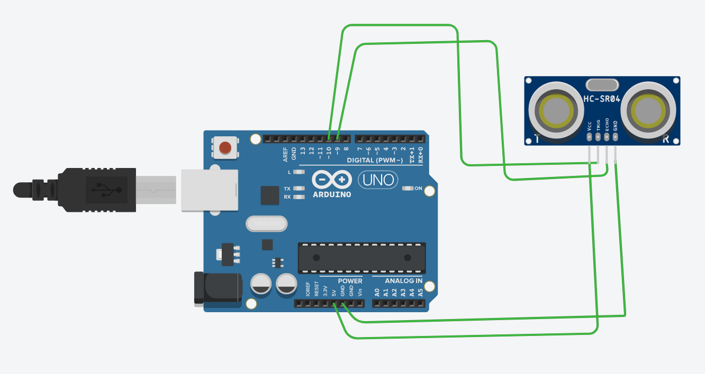

# ultrasonic-distance-measurement
Distance measurement using ultrasonic sensor with Arduino and Tinkercad
# Ultrasonic Distance Measurement using Arduino

## Description

This project demonstrates how to measure distance using an ultrasonic sensor (HC-SR04) with Arduino. The sensor calculates the distance of an object by sending and receiving ultrasonic waves.

## Components Used

* Arduino Uno
* Ultrasonic Sensor (HC-SR04)
* Jumper wires

## Working

The ultrasonic sensor sends ultrasonic waves through the TRIG pin. These waves reflect back from an object and are received by the ECHO pin. The Arduino calculates the time taken and converts it into distance.

## Circuit Diagram

## Code

The code is available here: [ultrasonic.ino](ultrasonic.ino)

## Applications

* Distance measurement
* Obstacle detection
* Robotics projects
* Parking sensors

## Author

HimagnaMovva27
